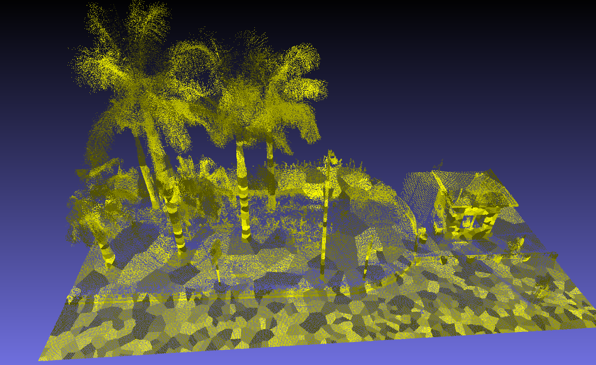

# Boundary Preserving SuperVoxel Clustering with CUDA acceleration
**Authors:** [Shi-Sheng Huang], please contact with me via shishenghuang.net@gmail.com

This is a C++ implementation of SuperVoxel cluster with CUDA acceleration, tested in Ubuntu 16.04


<!--  -->

The details can be found in the following [ISPRS 2018 paper](https://www.sciencedirect.com/science/article/pii/S0924271618301370)

Lin Y, Wang C, Zhai D, W Li, and J Li. Toward better boundary preserved supervoxel segmentation for 3D point clouds. Isprs Journal of Photogrammetry & Remote Sensing, vol. 143, pages 39-47, 2018.


# 2. Prerequisites
We have tested the library in **16.04**, but it should be easy to compile in other platforms. A powerful computer (e.g. i7) will ensure real-time performance and provide more stable and accurate results.

## C++11 or C++0x Compiler
We use the new thread and chrono functionalities of C++11.

## CUDA (e.g. version 9.0 higher), tested on CUDA 10.0, CUDA 9.0 may be ok
REQUIRED for all GPU accelerated code at least with cmake it is still possible to compile the CPU part without available at https://developer.nvidia.com/cuda-downloads

## Glog
```
sudo apt-get install libgflags-dev libgoogle-glog-dev
```

# 3. Compile

## build the Thirdparty
```
cd Thirdparty
mkdir build
cd build
cmake ..
make -j8
```

## build the libnormal.so libsupervoxel.so and examples
```
mkdir build
cd build
cmake ..
make -j4
```

# 4. Usage
<!-- the executive file is generated in Examples/RGB-D/rgbd_tum_fusion, note the calib file: Examples/RGB-D/config/calib.txt is the calib file for the reconstruction as shown in InfiniTAM, you can change the file according to your dataset and sensor -->

## how to use
### 1. Run the example
```
cd bin
./svcluster
```
<!-- the usage is:
```
Usage: ./runDynaSeg path_to_settings path_to_sequence path_to_association (see the source code for more details)
``` -->
<!-- 
### 2. Run the example

```
cd bin
./example [path_to_rgbd_files]
``` -->


